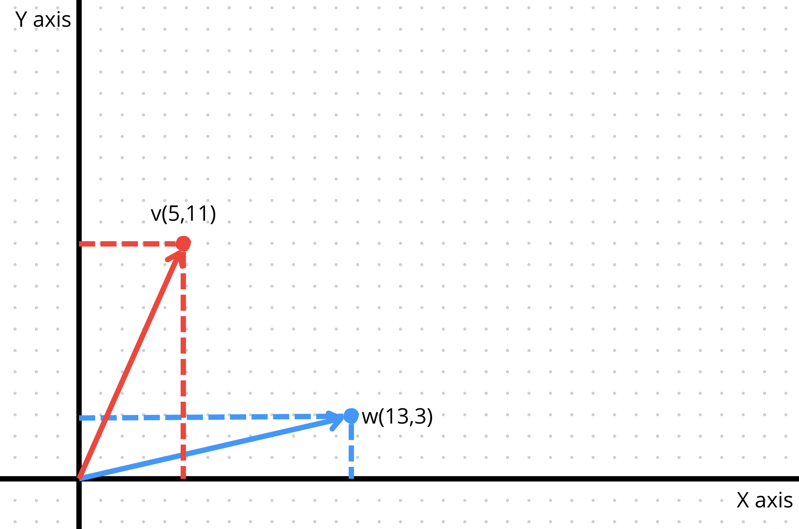
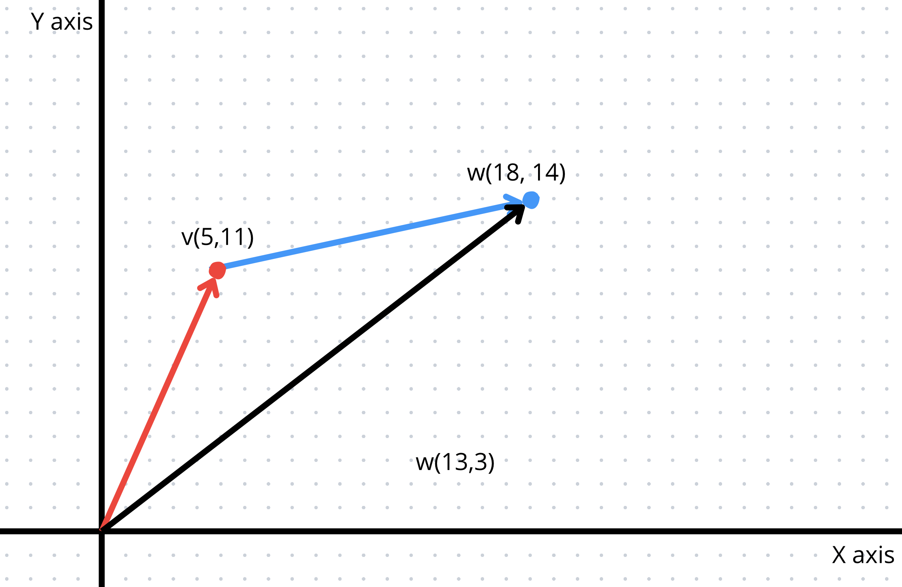
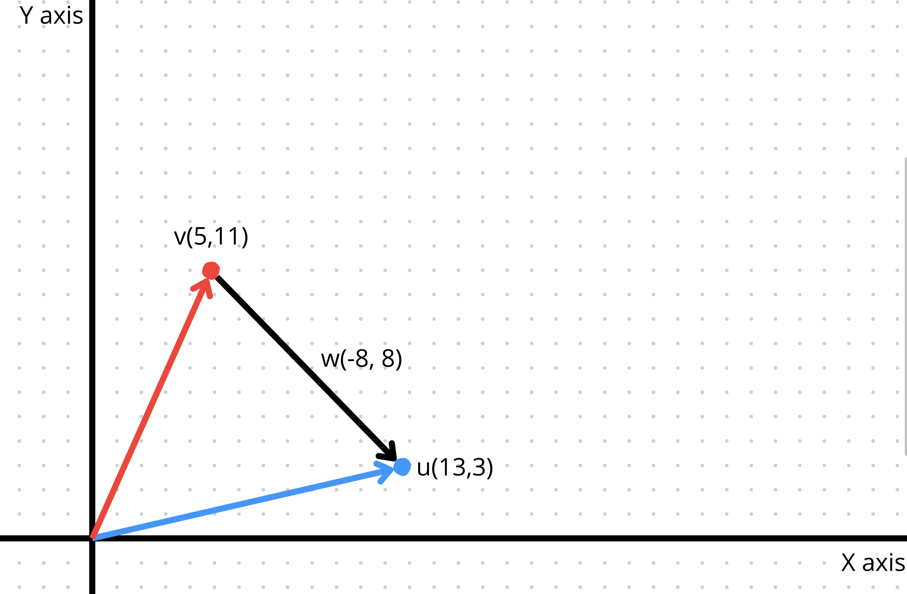
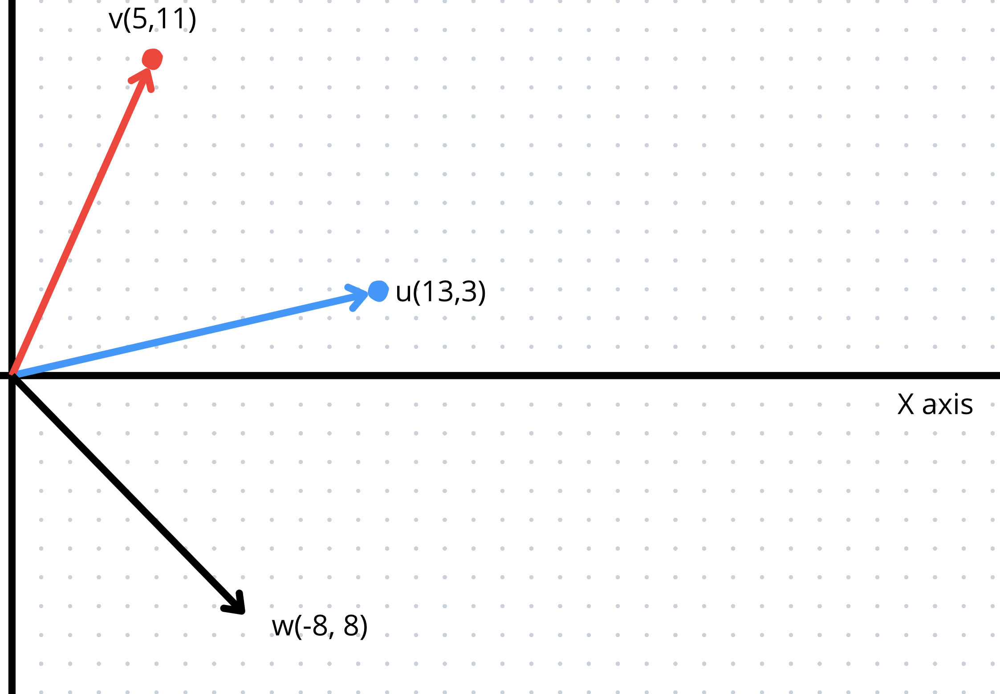
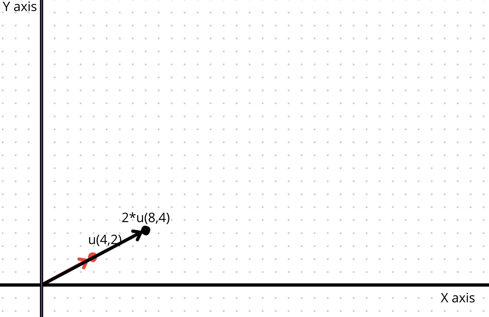
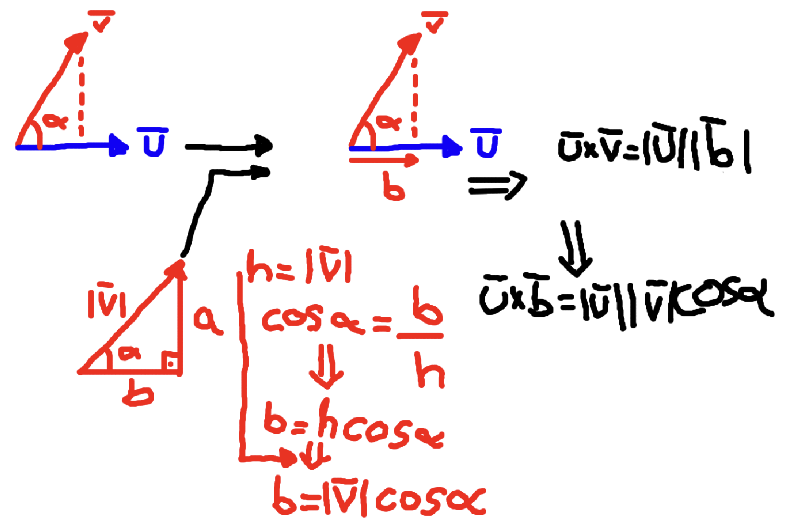

⠀⠀⠀⠀⠀⠀⠀⠀⠀⠀⠀⠀⠀⠀⠀⠀⠀⣀⠀⠀⠀⠀⠀⠀⠀⠀⠀⠀⢀⠀⠀⠀⠀⠀⠀⠀⠀⠀⠀⠀⠀⠀⠀⠀⠀⠀
⠀⠀⠀⠀⠀⠀⠀⠀⠀⠀⠀⠀⣀⣠⣤⣶⣿⣿⡷⠀⠀⠀⠀⠀⠀⠀⠀⣼⣿⣿⣶⣦⣄⣀⠀⠀⠀⠀⠀⠀⠀⠀⠀⠀⠀⠀
⣤⣴⣤⣤⣤⣤⣤⣤⣤⣤⣶⣿⣟⣛⣛⣻⣟⣛⣁⣤⣤⣤⣤⣤⣤⣤⣤⣬⣿⣛⣛⣛⣛⣛⣿⣶⣤⣤⣤⣤⣤⣤⣤⣤⣤⣴
⠉⠛⣿⣿⣿⠿⠿⠿⠿⠿⠿⠿⠿⠿⠿⠿⠿⠿⠿⠿⠿⢿⣿⣿⣿⡿⠿⠿⠿⢿⣿⠿⠿⠿⠿⠿⠿⠿⠿⠿⠿⢿⣿⣿⡿⠛
⠀⠀⢸⣿⣿⠀⠀⠀⠀⠀⣀⣠⠤⢶⣤⣀⠀⠀⠀⠀⠀⣸⣿⣿⣿⡇⠀⠀⠀⠀⠘⣦⡄⠀⠀⢀⡀⠀⠀⠀⠀⢀⣿⣿⡇⠀
⠀⠀⠀⣿⣿⡄⠀⠀⠀⢀⠋⠈⠀⣨⣿⡏⢳⡀⠀⠀⢠⣿⣿⣿⣿⣧⠀⠀⠀⠀⠀⣹⢿⡀⠀⠀⠙⣦⠀⠀⠀⢸⣿⣿⠁⠀
⠀⠀⠀⢿⣿⣇⠀⠀⠀⣾⣀⠄⡐⣿⣿⣿⣸⡇⠀⠀⣾⣿⣿⣿⣿⣿⡆⠀⠀⣤⣴⣿⣼⣷⡄⡄⢀⣼⠀⠀⠀⢸⣿⡿⠀⠀
⠀⠀⠀⠘⣿⣿⡄⠀⠀⠙⢿⣀⣿⣿⣿⣿⠟⠀⠀⢸⣿⣿⡟⠻⣿⣿⣷⡀⠀⠈⢿⣿⣿⣿⣷⣧⡾⠃⠀⠀⢠⣿⣿⠇⠀⠀
⠀⠀⠀⠀⠹⣿⣿⣦⣀⠀⠀⠉⠛⠛⠉⠁⠀⣀⣴⣿⣿⠟⠀⠀⠘⢿⣿⣷⣄⠀⠀⠉⠙⠛⠋⠉⠀⠀⣠⣶⣿⡿⠋⠀⠀⠀
⠀⠀⠀⠀⠀⣽⠻⢿⣿⣿⣶⣶⣶⣶⣶⣶⣿⣿⣿⠟⠋⠀⠀⠀⠀⠀⠛⢿⣿⣿⣷⣶⣶⣶⣶⣶⣾⣿⣿⡿⡟⠀⠀⠀⠀⠀
⠀⠀⠀⠀⠀⢿⠀⠀⠀⠉⠉⠉⠉⠉⠉⠉⠉⠁⠀⠀⠀⠀⠀⠀⠀⠀⠀⠀⠈⠉⠉⠉⠉⠉⠉⠉⠉⠉⠀⢲⡟⠀⠀⠀⠀⠀
⠀⠀⠀⠀⠀⠘⣇⠀⠀⠀⠀⠀⠀⠲⠂⠀⠀⠀⠀⠀⠀⠀⠀⠀⠀⠀⠀⠀⠀⠀⠀⠀⠄⠀⠀⠐⠀⠀⠀⣿⠃⠀⠀⠀⠀⠀
⠀⠀⠀⠀⠀⠀⠹⡄⠀⠀⠀⠀⠀⠀⠀⠀⠀⣾⣿⠖⠲⠶⢶⣶⣶⠖⠶⣿⣷⠂⠀⠀⠀⠀⠀⠀⠀⠀⣼⠇⠀⠀⠀⠀⠀⠀
⠀⠀⠀⠀⠀⠀⠀⢻⣄⠀⠀⠀⠀⠀⠀⠀⠀⠙⢻⡄⠀⠀⠀⠀⠀⠀⠀⣿⠟⠀⠀⠀⠀⠀⠀⠀⠀⣠⠏⠀⠀⠀⠀⠀⠀⠀
⠀⠀⠀⠀⠀⠀⠀⠀⠹⣦⡀⠀⠀⠀⠀⠀⠀⠀⠀⠙⠶⠤⠤⠤⠤⠴⠾⠋⠀⠀⠀⠀⠀⠀⠀⢀⡴⠋⠀⠀⠀⠀⠀⠀⠀⠀
⠀⠀⠀⠀⠀⠀⠀⠀⠀⠈⠻⣦⡀⠀⠀⠀⠀⠀⠀⠀⠀⠀⠀⠀⠀⠀⠀⠀⠀⠀⠀⠀⠀⢀⡴⠋⠀⠀⠀⠀⠀⠀⠀⠀⠀⠀
⠀⠀⠀⠀⠀⠀⠀⠀⠀⠀⠀⠈⠙⠲⣤⡀⠀⠀⠀⠀⠀⠀⠀⠀⠀⠀⠀⠀⠀⠀⢀⣴⠞⠋⠀⠀⠀⠀⠀⠀⠀⠀⠀⠀⠀⠀
⠀⠀⠀⠀⠀⠀⠀⠀⠀⠀⠀⠀⠀⠀⠈⠙⢧⣄⣀⠀⠀⠀⠀⠀⠀⠀⢀⣀⣴⣾⠋⠁⠀⠀⠀⠀⠀⠀⠀⠀⠀⠀⠀⠀⠀⠀
⠀⠀⠀⠀⠀⠀⠀⠀⠀⠀⠀⠀⠀⠀⠀⠀⠀⠀⠉⠛⠛⠛⠛⠛⠛⠛⠙⠉⠉⠀⠀⠀⠀⠀⠀⠀⠀⠀⠀⠀⠀⠀⠀⠀⠀⠀

# TODO
- Search for info about "fused multiply-add function"
- Funny
    -Triangle inequality
    -Hölder norms
    -Minkowski inequality
    -Frobenius norm

# Disclaimer
Some of the prototypes of functions or mains given by the subject sheet are wrong and I've fix them. 

# Index
0. [Preamble](#preamble)</br>
    0.1 [First thing to understand is what is a Vector?](#whatisavector)</br>
    0.2 [Ok then whats a matrix?](#whatsamatrix)</br>
    0.3 [How Im representing them?](#represent)</br>
1. [ex00 - Add, Subtract and Scale](#ex00)</br>
    1.1 [Adding and Subtracting two vectors](#vectoraddsub)</br>
    1.2 [Scaling a Vector](#vectorscale)</br>
2. [ex01 - Linear combination](#ex01)</br>
3. [ex02 - Linear interpolation](#ex02)</br>
4. [ex03 - Dot product](#ex03)</br>
5. [ex04 - Norm](#ex04)</br>
    5.1 [Taxicab/Manhattan norm](#taxicab)</br>
    5.1 [Euclidean norm](#euclidean)</br>
    5.1 [Supremum norm](#suprenum)</br>
6. [ex05 - Cosine](#ex05)</br>
7. [ex06 - Cross product](#ex06)</br>
8. [ex07 - Linear map, Matrix multiplication](#ex07)</br>

# Preamble  <a name="preamble"></a>
In this project we are gonna be working with matrixes and vectors in Rust. So before dwelve deeper into these concepts, we first have to understand what they are and how Im representing them.</br>

## First thing to understand is what is a Vector?<a name="whatisavector"></a></br>
To first understand this concept we have to place ourselves in a 2 dimensional space, a 2 dimensional grid. </br>
In this 2D space we have 2 main axis, te X and the Y axis, X being the horizontal one and y the vertical one (they are perpendicular). I'm supposing that we can all draw a line a write numbers in there so we are jumping to the 2D version of that.</br>
</br>
By using those 2 axis you can represent any point thats inside of that space by saying where it is on the X and Y axis. 
</br>
Well thats cool and all but we were here to understand what a vector is. The difference between a Vector and a Point is not that big, at least when it comes to representing them.</br>
A Vector is a point connected to the origin by a line, or if you prefer it this way, a line that goes from the origin to a point (The origin being the point (0,0)).</br>
It is defined by 2 characteristics:
- Direction: This would be the line in which this vector is drawn and in which direction it is pointing
- Magnitude/Module: The size of the vector. In terms of "lines" how long is the line

</br>

## Ok then whats a matrix?<a name="whatsamatrix"></a></br>

When it comes to explaining what a matrix is it is not that difficult to understand. A matrix a mathematical object used to store values in a rectangular array/table.</br>


## How Im representing them?<a name="represent"></a>
I've quickly explained what a Vector and a Matrix are but I havent gotten into planes, vector spaces...</br>To quickly explain this. We can define a plane as a 2D space, like the X/Y axis.</br>If we were to speak of a 3D vector, we would be talking about 3 axis (X/Y/Z). X, Y and Z are perpendicular and make a plane between each other.</br>What I just explained can happend is not just fixed to 3 diomensions. So technically a vector can have N elements, N being the amount of dimensions it is represented in.</br></br>So taking this into consideration we can represent a vector as an N sized array and a Matrix as N sized N sized arrays, aka and array and a double array.</br>
In Rust language:</br>
``````
pub struct Vector {
    pub array: Vec<f32>,
}
pub struct Matrix {
    pub array: Vec<Vec<f32>>,
}
``````
I would recommend making a couple methods first to interact with the data.
- Push: To add new elements to the array
- Remove: To remove the last element of the array
- Size: To get the size of the array
- from: To create that class
- Print: To print the array (this is achieved by an implementation)
- Clone: This will come in handy. You can also write this on top of the struct <code>#[derive(Clone)]</code> in order to have the compiler provide you a basic a clone implementation.</br>

# ex00 - Add, Subtract and Scale<a name="ex00"></a>
Basic operations with vectors are pretty easy, you can probably guess how they are done. But lets get into them, to really understand how to perform these operations.</br></br>
On a quick note, in order to operate with vectors they have to be in the same vectorial space. So you cannot add or subtract a 3D vector from a 2D vector.</br>Although you can think of a $N$ dimensional vector as a $M$ dimensional vector with a value $0$ in the other dimensions, where $N < M$.</br>
For example a 2D vector $\overline{u}_{2}=(2,3)$ can be understood as a 3D vector $\overline{u}_{3}=(2,3, 0)$. This can only be done from less to more dimensions and not the other way as you'd be losing information.</br>
## Adding and Subtracting two vectors<a name="vectoraddsub"></a>
Lets declare two generic vectors  $\overline{u}=(u_{x}, u_{y}, u_{z})$ & $\overline{v}=(v_{x}, v_{y}, v_{z})$</br>
Adding them would be as easy as adding each $\overline{u}$ component with each $\overline{v}$ componet. It would be something like this:</br>
$\overline{u} + \overline{v} = ([u_{x} + v_{x}], [u_{x} + v_{x}], [u_{x} + v_{x}])$</br>
The addition of two vector gives out another new one $\overline{w}$ ($\overline{w}=\overline{u}+\overline{v}$)</br>Subtracting them would be the same but chaging the $+$ for a $-$.</br>Now lets see how these 2 basic operations look on a coordinate system:</br>
### Base case
</br>
### Adding 2 vectors
</br>
### Subtracting 2 vectors
</br>
</br>
## Scaling a vector<a name="vectorscale"></a>
Now when it comes to scaling a vector, we can visualize it as "making the arrow larger".</br>
So if we had $\overline{u}=(1,2,3)$ and we wanted to scale it by $2$ we would just do this: $\overline{u} * 2 = (1 * 2, 2 * 2, 3 * 2) = (2, 4, 6)$</br>
</br>
## Now, Matrices<a name="matrixnow"></a>
Operating with matrices is really easy and kind of works like the vector addition, subtraction and scaling.</br>Just as with vectors, where they belong to the same vector space in order to operate with them, matrix must also be of the same dimensions in order to be added/subtracted, this meaning that they have to have the same number of rows and colums.</br> Now that got this clear, lets jump into this.

### Adding and subtracting Matrices
Lets define two matrices:
```math
A = \begin{bmatrix} A_{00} \ A_{01} \ A_{02} \\ A_{10} \ A_{11} \ A_{12} \\\ A_{20} \ A_{21} \ A_{22}\end{bmatrix}
```
```math
B = \begin{bmatrix} B_{00} \ B_{01} \ B_{02} \\\ B_{10} \ B_{11} \ B_{12} \\\ B_{20} \ B_{21} \ B_{22}\end{bmatrix}</br>
```
The addition or subtraction of these 2 matrixes would result in a new matrix $C$ of which each position ($C_{nm}$)would be the operation performed between the two values on the same position of each relative matrix ($A_{nm} \pm B_{nm}$).</br>
Lets see how this $C$ matrix would be:
```math
C = \begin{bmatrix} C_{00} \ C_{01} \ C_{02} \\\ C_{10} \ C_{11} \ C_{12} \\\ C_{20} \ C_{21} \ C_{22}\end{bmatrix} \implies C_{nm} = A_{nm} \pm B_{nm}
```
so the lets see the operation matrix 
```math
C = \begin{bmatrix} 
(A_{00} \pm B_{00}) \ (A_{01} \pm B_{01}) \ (A_{02} \pm B_{02}) \\\
(A_{10} \pm B_{10}) \ (A_{11} \pm B_{11}) \ (A_{12} \pm B_{12}) \\\
(A_{20} \pm B_{20}) \ (A_{21} \pm B_{21}) \ (A_{22} \pm B_{22})
\end{bmatrix}
```

### Scaling a matrix
Scaling a matrix is just like scaling a vector, where you have to multiply each component by the scalar (number) you want to scale it for.</br>
So if we define $\alpha \in [-\infty, +\infty]$ (AKA any real number although it also applies to imaginary ones) and the same $C$ matrix as before we can compute the scaled matrix $M = \alpha C$ as:</br>
```math
M = \begin{bmatrix} \alpha C_{00} \ \alpha C_{01} \ \alpha C_{02} \\\ \alpha C_{10} \ \alpha C_{11} \ \alpha C_{12} \\\ \alpha C_{20} \ \alpha C_{21} \ \alpha C_{22} \end{bmatrix}
```


# ex01 - Linear combination<a name="ex01"></a>

A linear cobination is a operations that adds 2 in order to get a new one (still inside of the same vectorial space).</br>
So in order to get the linear combination of two vectors you have to multiply each one with a scalar (scalar is the noun used to refer to numbers that are not vectors) and then add both. It would look something like this:</br>

$\alpha\overline{u} + \beta\overline{v} + \lambda\overline{w} = (\alpha u_{1}, \alpha u_{2}, \alpha u_{3}) + (\beta v_{1}, \beta v_{2}, \beta v_{3}) + (\lambda w_{1}, \lambda w_{2}, \lambda w_{3})$</br>
$\alpha\overline{u} + \beta\overline{v} + \lambda\overline{w} =(\alpha u_{1} + \beta v_{1} + \lambda w_{1},\alpha u_{2} + \beta v_{2} + \lambda w_{2}, \alpha u_{3} + \beta v_{3} + \lambda w_{3})$</br>

The result of the operation is a new vector.

# ex02 - Linear interpolation<a name="ex02"></a>
In this exercise we have to make a function that returns the linear interpolation between 2 objects, let these be Vectors, Matrices or just numbers.</br>
What a linear interpolation is in terms of understanding it, is really simple. You have 2 objects and a coefficient. The coefficient must be a real number between 1 and 0 ($c \in [0;1]$)</br>
You have to add those items, the first one scaled by the coefficient and the other one by $1 - coefficient$ so that the two scalars add up to one. This way you get a "point" thats between those 2 objects. Altough you always get a value thats between the segment those 2 objects make, if you were to take any value for the coefficient, you would get any point in the infinite line drawn by the two objects</br>
//TODO Add image</br>
So the operation would look something like this:</br>
$cV_{1} + (1 - c)V_{2}$
</br>

# ex03 - Dot product<a name="ex03"></a>
In this exercise we have to compute the dot product between 2 vectors of the same dimentions.</br>
What this really does is multipliying the module of $\overline{u}$ and module of the projection of $\overline{v}$ on $\overline{u}$.</br>
Lets specify this a little bit more specific:</br>
We have 2 vectors $\overline{u}$ & $\overline{v}$, they are both inside of the same vectorial space $V$, which is finite, and they are both composed of real numbers ($\real$).</br></br>
To understand this we are gonna first understand what the projection of a vector is.</br>
Lets define $\overline{u} = (1,1)$, if we were to have the projection of $\overline{u}$ over the $x$ axis, it would just be $1$, as its $x$ component is $1$. If we had a vector $\overline{v} = (3,5)$ its projection on the $y$ axis would be $5$ and $3$ on the $x$ axis.</br></br>
We can rearange how we think of the $x$/$y$ axis and rethink of them as two vectors. $\overline{i} = (1, 0)$ as the $x$ axis and $\overline{j} = (0, 1)$ as the $y$ axis, as we can write any vector in a 2 dimensional space as a linear combination of $\overline{i}$ and $\overline{j}$</br>. In this case the projection of the vector of $\overline{v} = (3,5)$ over $\overline{i}$ would still be $3$ and over $\overline{j}$ would be $5$.</br></br>
Ok now we can finally get into how to get the Dot product between two vectors:</br>
We can think of the projection of a vector $\overline{u}$ on $\overline{v}$ as we did with $\overline{u}$ on the $\overline{i}$/$\overline{j}$ vectors. The problem is that there was not mathematical proof of what we did, we just kind of agreed it made sense, so now Im gonna explain on concept and then we are gonna be using one of the most famous theorems...

### The Pythagorean theorem
Ok I'm not gonna go deeper into this, so if you want me to prove this you can just do some research for yourself as this is theorem is probably a little bit older than you.</br>[You lazy fuck](#https://en.wikipedia.org/wiki/Pythagorean_theorem)</br></br>
If we have two vectors $\overline{u} = (x_{u}, y_{u})$ and $\overline{v} = (x_{v}, y_{v})$ we can write a right triangle in which the angle $\alpha$ as the angle between $\overline{u}$ and $\overline{v}$.</br>
In this triangle we already know $\alpha$, but we need to other componenets. The hypotenuse is the module of $\overline{v}$. To get the value of the two other side (the catheti) is really easy to guess.</br>
By defining the $cosine$ of $\alpha$ as $cos(\alpha)=(\frac{b}{h})$, as $h$ is the hypotenuse which we can get by calculating the module of the vector $\overline{v}$ which you can get with the Pythagorean theorem $\implies h = \sqrt{x_{v}^2 + y_{v}^2}\implies |\overline{v}| = h$.</br>
We wanna know the value of $b$ as is the only value missing and is also the projection of $\overline{v}$ on $\overline{u}$. With a little bit of imagination we can do this:</br>
$cos(\alpha)=(\frac{b}{h})\implies h * cos(\alpha) = b \implies |\overline{v}| * cos(\alpha) = b$</br>
This is how we get the module of the projection of the $\overline{v}$ on $\overline{u}$, now we just have the get the module of $\overline{u}$ which I already explained is done by the Pythagorean theorem (the module calculation is gonna get explain in ex04 more in depth). So we can guess that the dot product of two vectors can be written like this:</br>
$\overline{u}*\overline{v}=|\overline{u}||\overline{v}|cos(\alpha_{\hat{uv}})$</br>
</img>

# ex04 - Norm<a name="ex04"></a>

